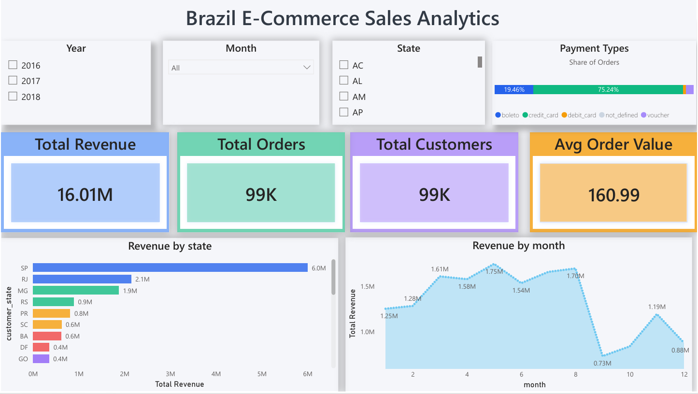
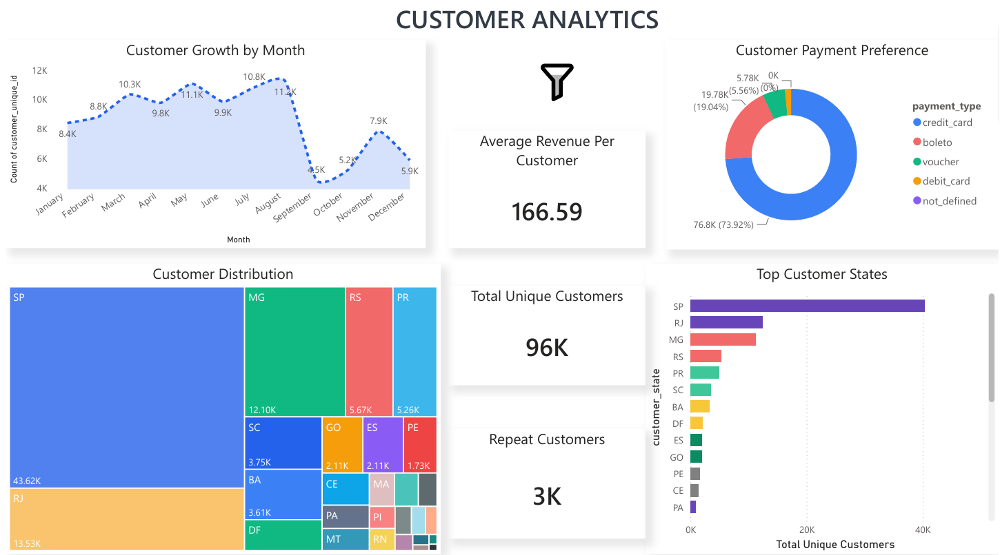
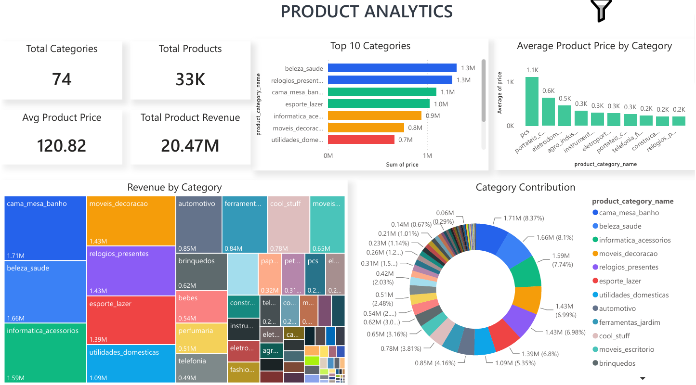
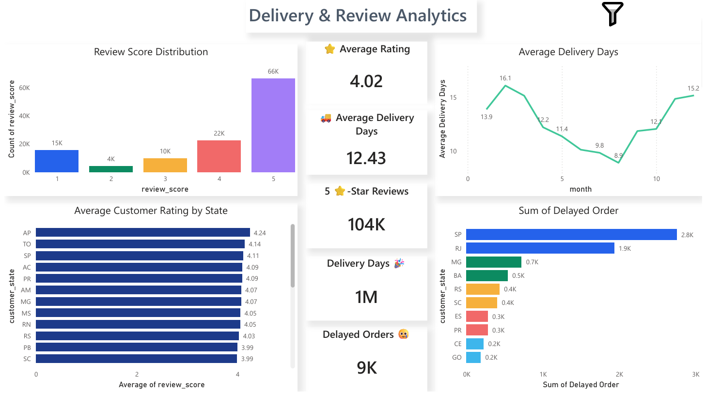

# 🛒 End-to-End E-Commerce Analytics Project

## 📌 Project Overview

This project demonstrates an end-to-end Data Analytics workflow using the Brazilian E-Commerce Public Dataset by Olist. The objective is to analyze sales performance, customer behavior, product trends, and delivery performance while building an interactive Power BI dashboard.

The project covers the complete analytics lifecycle, including data cleaning, SQL analysis, exploratory data analysis (EDA), KPI calculation, and dashboard development.

---

# 📊 Project Architecture

```
Dataset
   ↓
Python (Data Cleaning)
   ↓
MySQL (Data Storage)
   ↓
SQL Analysis
   ↓
Python EDA
   ↓
Power BI Dashboard
   ↓
Business Insights
```

---

# 🛠 Tools & Technologies

- Python
- Pandas
- NumPy
- Jupyter Notebook
- MySQL
- SQL
- Power BI
- Git
- GitHub

---

# 📂 Dataset

**Dataset Name:** Brazilian E-Commerce Public Dataset by Olist

The dataset contains information about:

- Customers
- Orders
- Order Items
- Products
- Payments
- Reviews

---

# 🔄 Data Processing

The following steps were performed before analysis:

- Imported multiple CSV datasets
- Handled missing values
- Removed duplicate records
- Converted date columns to DateTime format
- Merged multiple datasets into a single analytical table
- Created Month and Year columns
- Prepared data for SQL and Power BI analysis

---

# 🗄 SQL Analysis

The following business questions were answered using SQL:

- Total Revenue
- Total Orders
- Total Customers
- Monthly Revenue
- Top Revenue Generating States
- Top Product Categories
- Average Order Value
- Customer Ranking using Window Functions
- Product Performance Analysis

---

# 📈 Exploratory Data Analysis (EDA)

Performed using Python (Pandas, Matplotlib and Seaborn)

Visualizations include:

- Monthly Revenue Trend
- Customer Distribution by State
- Payment Type Distribution
- Review Score Distribution
- Product Category Analysis
- Revenue by Category

---

# 📌 Key Performance Indicators (KPIs)

- Total Revenue
- Total Orders
- Total Customers
- Average Order Value
- Average Product Price
- Repeat Customers
- Average Delivery Days
- Average Customer Rating

---

# 📊 Power BI Dashboard

The interactive dashboard consists of four pages.

## Page 1 – Executive Summary

- Total Revenue
- Total Orders
- Total Customers
- Average Order Value
- Monthly Revenue Trend
- Revenue by State

---

## Page 2 – Customer Analytics

- Customer Distribution
- Repeat Customers
- Payment Preference
- Customer State Analysis

---

## Page 3 – Product Analytics

- Top Categories
- Revenue by Category
- Category Contribution
- Top Products

---

## Page 4 – Delivery & Review Analytics

- Average Delivery Days
- Delayed Orders
- Review Score Distribution
- Average Rating by State

---

# Dashboard Preview

## Executive Summary



## Customer Analytics



## Product Analyticw



## Delivery Review Analytics




---

# 📈 Business Insights

- Identified the highest revenue-generating states.
- Analyzed monthly sales trends and seasonality.
- Evaluated customer purchasing behavior.
- Compared product category performance.
- Measured customer satisfaction using review scores.
- Identified delivery performance trends and delayed orders.
- Calculated key business KPIs for executive reporting.

---

# 📁 Repository Structure

```
E-Commerce-Analytics/
│
├── Dashboard/
│   ├── Ecommerce_Dashboard.pbix
│   ├── Executive_Summary.png
│   ├── Customer_Analytics.png
│   ├── Product_Analytics.png
│   └── Delivery_Review_Analytics.png
│
├── Notebook/
│   └── Ecommerce_Analysis.ipynb
│
├── SQL/
│   └── Ecommerce_SQL_Queries.sql
│
├── Data/
│   └── Sample_Data.csv
│
├── README.md
├── requirements.txt
└── .gitignore
```

---

# 🚀 Skills Demonstrated

- Data Cleaning
- Data Wrangling
- Data Transformation
- SQL Query Writing
- Window Functions
- Data Visualization
- KPI Development
- Business Analysis
- Dashboard Design
- Data Storytelling

---

# 🎯 Project Outcome

This project demonstrates an end-to-end analytics workflow that converts raw transactional data into actionable business insights. It highlights practical skills in Python, SQL, and Power BI while showcasing the ability to build executive-level dashboards for data-driven decision-making.

---

## 👨‍💻 Author

**Hari Perugu**

- GitHub: https://github.com/PeruguHari
- LinkedIn: *(https://www.linkedin.com/in/peruguhari)*